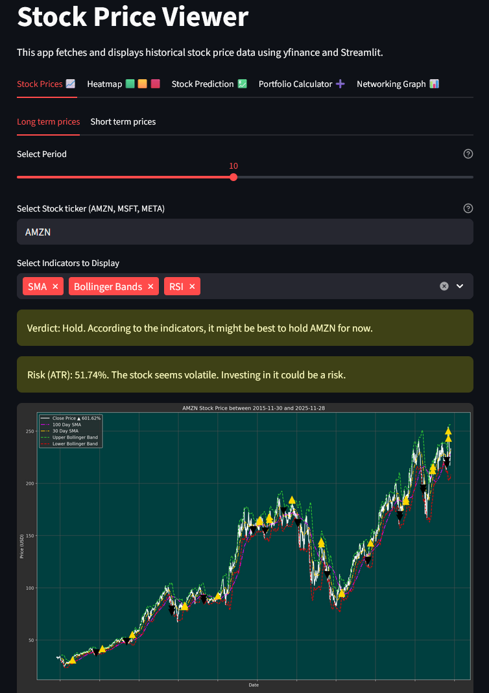
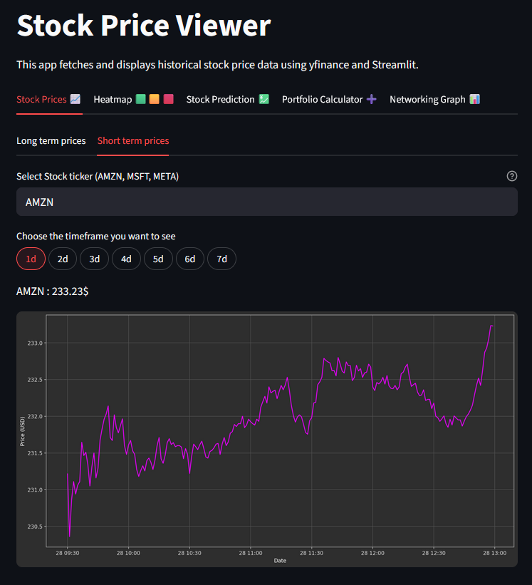
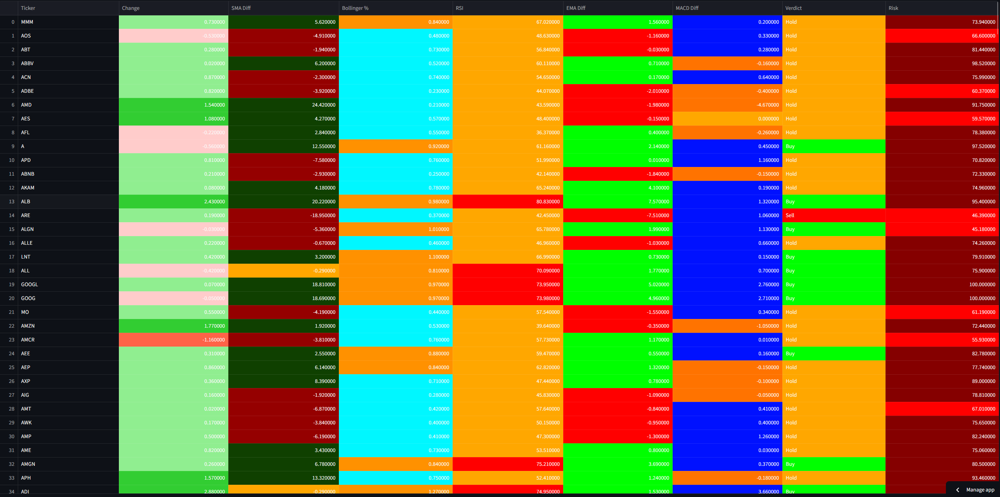
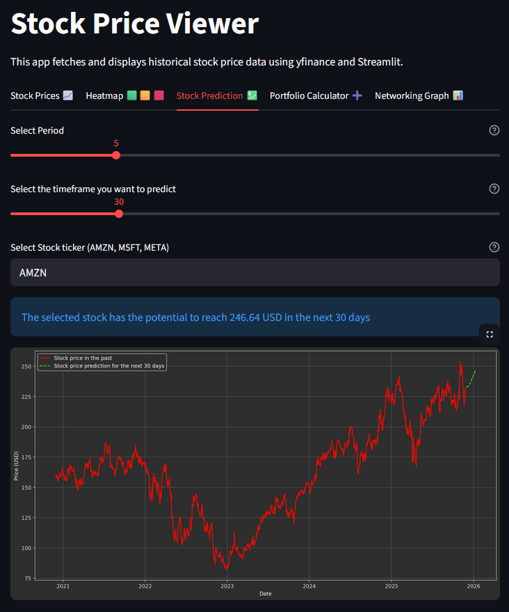
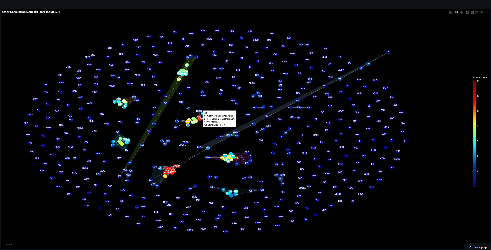
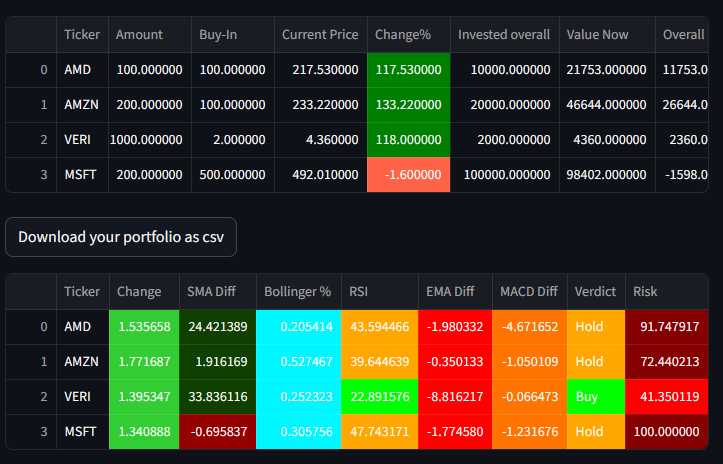

# Stock Market Analysis Tool: Live Demo: https://stockmarketanalyzer-fabif.streamlit.app/

An interactive stock analysis and visualization platform designed to bring together price data, technical indicators, heatmaps, portfolio tracking, and network analysis in a single, user-friendly interface.  
The application runs in the browser using Streamlit and requires no complex setup.

---

## 🚀 Key Features

### 📊 Market & Data Analysis
- Fetch stock data from S&P 500 or user-selected tickers



- (Almost) real-time price updates



- Comprehensive technical indicators:
  - SMA, EMA, ATR, RSI, MACD and more

- Heatmaps for all S&P 500 tickers


- Deterministic prediction model


- Extensive verdict system for buy signals

### 🌐 Interactive Visualizations
- Fully interactive hotspot network visualization (Plotly)
- Multiple charting and overview dashboards



### 💼 Portfolio Tracking
- Lightweight and easy-to-use portfolio management interface
- Endless potential for expansion


### ⚙️ Robust Error Handling
- Invalid input does not crash the application
- Users are informed via clear error messages
- Users can continue working without restarting
- Despite precautions, bugs may still occur – please report them

### 🔮 Future Plans
- Performance optimization for heatmaps and networks
- Optional C++ acceleration for heavy computations
- Upgrade static plots to fully interactive (Matplotlib → Plotly)

---

# 💡 How Does It Work?

1. Start the application using Streamlit (see below)
2. The app opens in your default browser
3. Streamlit may need a few seconds to wake up when launched
4. Explore different dashboards and tools freely

**Note:**  
Generating large network graphs can take time.  
Using historical data is usually faster.

---

# 🧰 Installation

## 🔧 Requirements
- Python 3.9 or newer
- pip installed

## 📥 Clone Repository

```bash
git clone github.com/fabianfrank-ai/Stock_Market_Analyzer.git
cd Stock_Market_Analyzer
pip install -r requirements.txt
streamlit run stock_crypto/main.py
```

# 📂 Usage
Once launched, the user can:
- Select a ticker from the S&P 500 or enter their own
- View price history and indicators
- Generate heatmaps
- Display network visualizations
- Build and analyze a portfolio
- Run price predictions
- Interpret automatic verdicts for decision support
Everything is controlled through the Streamlit browser interface.

# 📑 License
This project is released under the terms of the license included in this repository.

